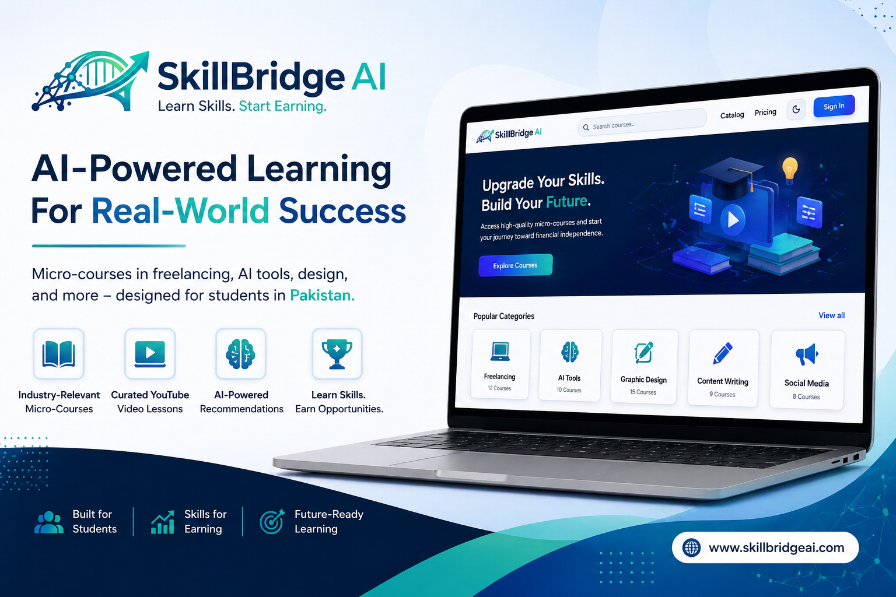

<div align="center">



# SkillBridge AI
### 🚀 Learn Skills. Start Earning.

[](https://choosealicense.com/licenses/mit/)


**Empowering Pakistani students with practical, income-generating digital skills through AI-powered micro-learning.**

</div>

---

## 📖 About The Project

**SkillBridge AI** is a specialized micro-skills learning platform tailored for the Pakistani student demographic. Our mission is to bridge the gap between traditional education and the digital economy by providing affordable, AI-curated pathways to high-income skills. 

By leveraging the power of AI and curated YouTube content, we offer a streamlined learning experience that focuses on practical application rather than just theory, helping users transition from learners to earners in the shortest time possible.

## ✨ Features

- 🔐 **Secure Authentication** - Robust user sign-in and sign-up powered by Firebase.
- 🔍 **Smart Course Search** - Efficiently find the exact skill you want to master.
- 📺 **YouTube-Powered Learning** - Curated high-quality video content via YouTube Data API.
- 🎨 **Modern Responsive UI** - A premium, sleek interface that works flawlessly on all devices.
- 🌓 **Dark / Light Mode** - Eye-friendly themes for long learning sessions.
- 🤖 **AI-Style Recommendations** - Smart content suggestions based on popular skills.
- 💎 **Flexible Pricing Plans** - Affordable tiers designed for student budgets.
- 📊 **User Dashboard** - Personalized space to manage your learning journey.
- 📱 **Mobile-First Design** - Learn on the go with a fully optimized mobile experience.


## 🛠️ Tech Stack

SkillBridge AI is built with modern, industry-standard technologies:

*   **Frontend Framework:** [React.js](https://reactjs.org/) (v18+)
*   **Build Tool:** [Vite](https://vitejs.dev/)
*   **Styling:** [Tailwind CSS](https://tailwindcss.com/)
*   **Backend & Auth:** [Firebase](https://firebase.google.com/)
*   **Animations:** [Framer Motion](https://www.framer.com/motion/)
*   **Routing:** [React Router](https://reactrouter.com/)
*   **APIs:** YouTube Data API v3

## 🚀 Installation

Follow these steps to set up the project locally:

1.  **Clone the repository**
    ```bash
    git clone https://github.com/m-zeyyan/SkillBridgeAI.git
    ```

2.  **Install dependencies**
    ```bash
    npm install
    ```

3.  **Start the development server**
    ```bash
    npm run dev
    ```

## 🔑 Environment Variables

To run this project, you will need to add the following environment variables to your `.env.local` file:

```env
VITE_FIREBASE_API_KEY=your_api_key
VITE_FIREBASE_AUTH_DOMAIN=your_auth_domain
VITE_FIREBASE_PROJECT_ID=your_project_id
VITE_FIREBASE_STORAGE_BUCKET=your_storage_bucket
VITE_FIREBASE_MESSAGING_SENDER_ID=your_sender_id
VITE_FIREBASE_APP_ID=your_app_id
VITE_YOUTUBE_API_KEY=your_youtube_api_key
```

## 📁 Folder Structure

```text
src/
├── components/     # Reusable UI components
├── pages/          # Full page layouts
├── services/       # API and Firebase configurations
├── context/        # Global state management (Auth, Theme)
├── assets/         # Images and styles
└── App.jsx         # Root component
```

## 🗺️ Future Improvements

- [ ] **AI Personalized Roadmap** - Generate custom learning paths based on career goals.
- [ ] **Real Progress Tracking** - Detailed analytics on course completion and quiz scores.
- [ ] **Certificate System** - Verifiable digital certificates for completed micro-skills.
- [ ] **Payment Integration** - Seamless localized payment gateways (Easypaisa/JazzCash).
- [ ] **Mentor Marketplace** - Connect with industry experts for 1-on-1 guidance.

## 👤 Author

**Muhammad Zeyyan Butt**
- GitHub: [Zeyyan15](https://github.com/Zeyyan15)
- LinkedIn: [Muhammad Zeyyan](https://linkedin.com/in/muhammad-zeyyan)

## ⚖️ License

Distributed under the MIT License. See `LICENSE` for more information.

---

<div align="center">
    Developed with ❤️ for the students of Pakistan.
</div>
